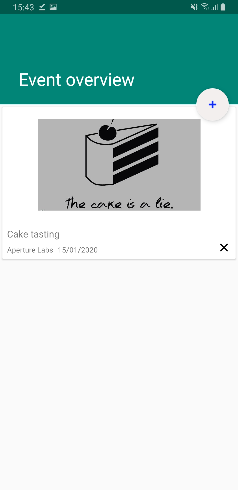

# Travel Diary

Travel Diary is a simple diary app for all your travelling needs. You can create a diary for each trip and log your journey with events. Each event will require a photo for it to be marked as completed. It's perfect if you're going on a trip and want a fun way to log all the good moments!

## Features

- [x] Diary overview
- [x] Creation and modification of diaries
- [x] Event overview
- [ ] Creation and modification of each event in a diary
  - [x] Creation
  - [x] Marking as completed
  - [x] Fields:
    - [x] Name
    - [x] Date
    - [x] Location
    - [x] Completion photo
- [ ] Possible future plans
  - [ ] ?

You can follow the progress and task division in the issue tracker.

## Screenshots

[Click here for an interactive demo](https://balsamiq.cloud/sx17gu0/ptf5npm/r2278?f=N4IgUiBcCMA0IDkpxAYWfAMhkAhHAsjgFo4DSUA2gLoC%2BQA%3D)
