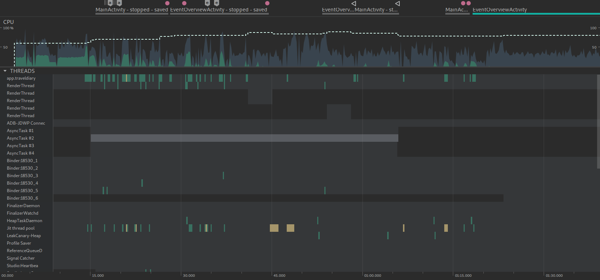

# Cpu

Utilizando o Android Profiler foi gerado o seguinte gráfico.

Onde a linha tracejada é o número de threads utilizadas, que ficaram em média em 45 threads. O verde mais escuro é o uso de CPU de outros
e o verde mais claro é o uso de CPU do aplicativo.
Como é possível ver, o uso de CPU foi baixo e não foi preciso nenhuma alteração no código por conta disso.
