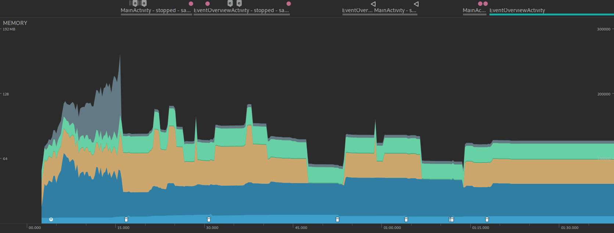

# Memória

Através do Android Profiler coletamos o uso da memória durante a interação com o aplicativo.

O azul mais claro é a utlizada pelo Java, a azul mais clara pelo código nativo, a amarela pelos gráficos, a verde clara pelo código,
a verde escura pela stack e a cinza são outros. Como pode-se obversar, o consumo se mantém quase que constante durante o uso do aplicativo.
Além de que é possível ver a ação do garbage collector pelos simboloso de lixeira na parte de baixo da imagem.
